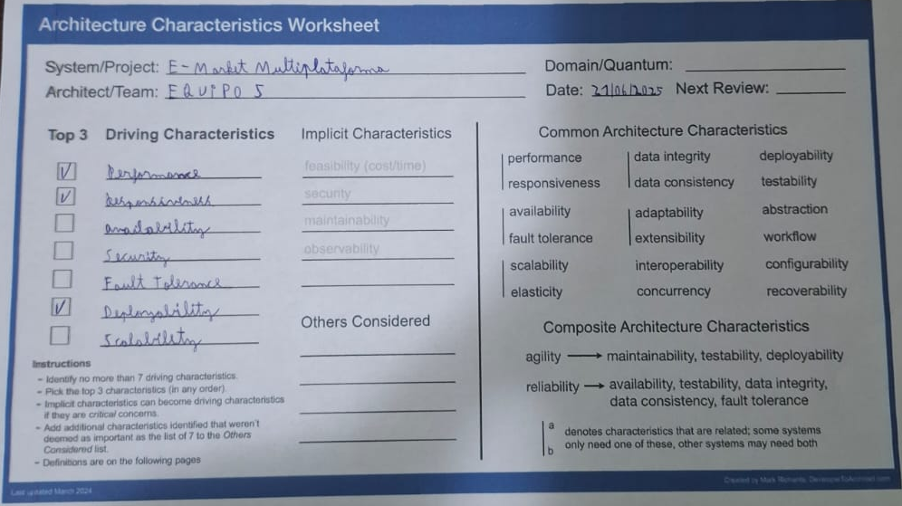
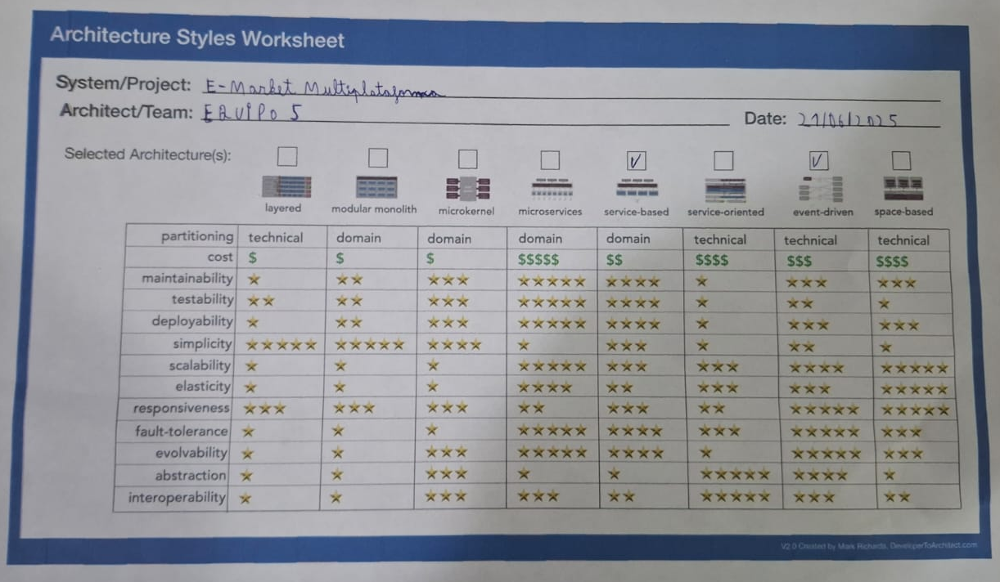

# PROYECTO FINAL DE ARQUITECTURA DE SOFTWARE

### Estudiantes
* Calle Coymbra Al Ivan
* Mollinedo Franco Milena
* Ramirez Flores Juan Vladimir
* Ribera Hervas Anthony

## 1.​ Identificar las características de arquitectura

### Características
#### Performance
Es necesario que el sistema sea rápido para poder realizar los procesos y funciones, además que las puede ejecutar sin problemas. Por ejemplo, queremos que los proveedores puedan cargar sus inventarios sin ningún problema, también queremos que los clientes puedan hacer varios pedidos de diferentes proveedores sin que se presente algún error. Por esta razón esta característica ha sido elegida como una de las tres principales características del sistema, debido a que su cumplimiento satisface al usuario.

#### Responsiveness
Al ser un sistema de comercio electrónico este sistema tendrá una gran tráfico de usuarios aún más en la temporada de ventas donde habrá picos de tráfico. Es necesario que el sistema pueda responder sin problema y sin demora a las peticiones del usuario, debido a que una de las claves del sistema es que este pueda responder al usuario en un tiempo corto. Esta es la razón por lo que esta característica ha sido elegida como una de las tres principales características del sistema.

#### Deployability
Debido a que siempre actualizamos el sistema a través de la creación de nuevas funciones es muy importante saber cuándo y a qué hora hacer el deploy de la nueva versión del sistema sin que se interrumpa la cualquier actividad que esté haciendo el usuario. Debido al impacto que tiene al hacer el deploy sin que se vea afectado el usuario final es que decidimos convertirlo en una de las tres principales características del sistema.

#### Availability
Tiempo que nuestro sistema estará disponible para el usuario final, con esto queremos decir que nuestro sistema tenga un horario en el que esté disponible para que pueda realizar las necesidades que quiere el usuario. Al ser nuestro sistema un sistema de comercio multiplataforma es necesario determinar cuando nuestro sistema está disponible para el usuario.

#### Security
El sistema al interactuar con métodos de pago y cuentas bancarias, es necesario que los datos privados y financieros de los usuarios estén protegidos de posibles ciberataques o robo de información ya sea personal o financiera del usuario, lo cual lo pondría en peligro.

#### Fault Tolerance
Es importante que si algo pasa a alguno de los módulos del sistema ya sea por cualquier razón es importante es que este error no afecte a los otros módulos del sistema, por ejemplo si el módulo de reportes presenta un error, esto no debería afectar al funcionamiento del módulo de ventas.

#### Scalability
Es normal que el sistema que estamos desarrollando crezca tanto en capacidad, tamaño, número de usuarios y requests de los usuarios. Esta característica se encargará de que el performance y responsiveness permanezcan constantes en su funcionamiento.

## 2.​ Seleccionar del estilo arquitectónico

### Estilos de arquitectura seleccionados
* Service based
* Event driven

#### Justificación
Escogimos los estilos distribuidos ya que son los que cumplen con darnos un buen desarrollo de las características de arquitectura que deseamos aplicar a nuestro software como son performance, responsiveness y deployability. Para nuestro sistema hemos escogido los estilos de basado en servicios y basado en eventos.

* **Basado en servicios**: Es un estilo ordenado que nos recuerda a los estilos monolíticos, debido a que los servicios que usamos son desplegados independientemente y separadamente, poseen cierta granulación que podemos decir que nuestros servicios son porciones de una aplicación. Los servicios que usamos no requieren de containers ya que nuestros servicios están desplegados de la misma manera que una aplicación monolítica. El estilo de diseño de los servicios es parecido a n capas, usando un estilo de arquitectura consistente  de capa API facade, una capa de negocios y una capa de persistencia. Mayormente se trabaja con una sola base de datos, pero podemos usar más de una base de datos si queremos. Este estilo es bueno como se puede ver en la imagen con: costo, maintainability, testability, deployability y responsiveness.

* **Basado en Eventos**: Usamos el estilo basado en eventos con topología broker debido a que nos puede ayudar en flujos complejos como por ejemplo la realización de pagos, además de reducir el punto único de falla  y de darnos una mejor consistencia de datos lo cual nos ayuda a la hora de realizar los pagos y gestión de pedidos. También es un estilo que suele combinarse con otros estilos creando un estructura híbrida, ya que aplicando estilo basado en eventos podemos reducir cuellos de botellas y provee un buen nivel de respuesta al usuario. Este estilo también es bueno con las características: responsiveness, fault-tolerance y scalability.

## 3.​ Representación arquitectónica (con C4)

### System context

### Containers

### Components

## 4.​ Proponer organización de código

[Archivo README.md detallado](README.md)

## 5.​ Calcular distancia desde la secuencia principal(componentes críticos)

## Autoevaluación sobre participación en equipo

* Anthony Ribera Hervas: 5/5
* Al Ivan Coymbra Calle: 5/5
* Juan Vladimir Ramirez Flores: 5/5
* Milena Franco Mollinedo: 5/5