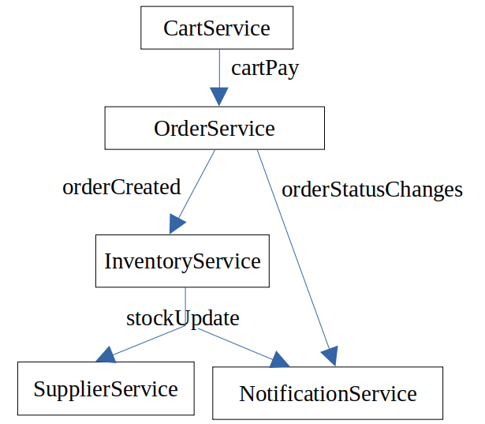

# Proyecto E-Market Multiplataforma

## Arquitecturas

### 1. Service Based

#### Estructura del proyecto
📁 **dto/**  Archivos de definicion de Interfaces.

📁 **entities/**  Archivos con acceso a base de datos.

📄 ***.service**: Clase que utiliza las ` entities` y las reglas de negocio.

📄 ***.controller**: Clase que maneja los `services` y recibe los **requests** y realiza los **responses** del endpoint.

#### Modulos
* Business (Catalog, Category, Company, Product, Service, Supplier)
* Client (Client)
* User (Auth, Permission, User)

### 2. Event Driven (broker)

#### Estructura del proyecto
📁 **dto/**  Archivos de definicion de Interfaces.

📄 ***.entity** Clase con acceso a base de datos.

📄 ***.service**: Clase que utiliza las `entities` maneja las reglas de negocio, tambien emite los `events` a los suscriptores.

📄 ***.controller**: Clase que maneja los `services` y recibe los **requests** y realiza los **responses** del endpoint.

#### Endpoints
* cart
* inventory
* notification
* order
* supplier

#### Flujo de eventos
